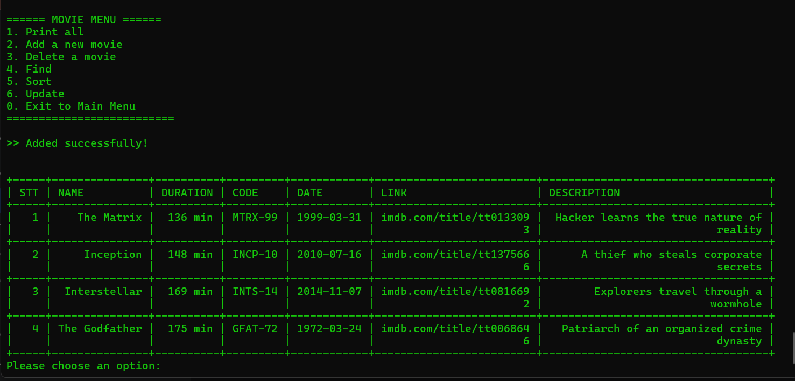
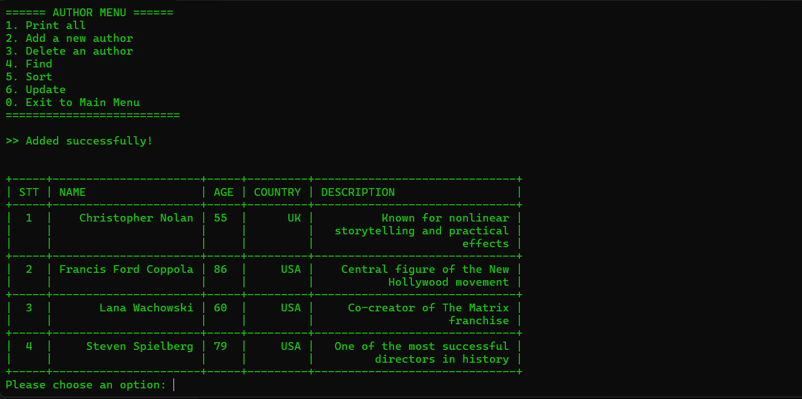

# 🎬 Movie & Author Management System (Console App)

A robust, object-oriented Console Application built with Java for managing movies and authors. The system features user authentication, ensuring that each user has a private workspace for their data. 

This project demonstrates the practical application of the **DAO (Data Access Object) Design Pattern**, **CRUD operations**, and **clean Console UI design**.

## ✨ Key Features

**Movie Management Interface:**


**Author Management Interface:**


### 🔐 User Authentication
* **Register/Login:** Secure access to the system.
* **Data Isolation:** Users can only view, modify, and delete their own movies and authors.

### 📼 Movie Management
* **View:** Displays all movies in a beautifully formatted ASCII table.
* **Add:** Insert new movies with details like Name, Duration, Release Date, Code, Link, and Description. (Includes validation for date formats and mandatory fields).
* **Update:** Modify specific columns of an existing movie.
* **Delete:** Remove a movie securely using its Display ID (STT).
* **Find:** Search for movies by name.
* **Sort:** Order the movie list by Name, Duration, or Date in Ascending/Descending order.

### ✍️ Author Management
* Similar full CRUD, Search, and Sort capabilities as Movie Management, tailored for Author attributes (Name, Age, Country, Description).

### 🖥️ UI / UX Enhancements
* **Clean Terminal:** Utilizes ANSI escape codes to clear the screen and remove invalid inputs instantly, preventing console clutter.
* **Ascii-Table Integration:** Uses `freva/ascii-table` to render database records into neat, readable grid layouts.
* **Robust Input Handling:** Custom `InputUtils` prevents the app from crashing during `InputMismatchException` or invalid formats.

## 🛠️ Technologies & Architecture

* **Language:** Java (JDK 8+)
* **Database:** Relational Database via JDBC (SQLite / MySQL)
* **Libraries:** * `com.github.freva:ascii-table` (For console formatting)
* **Architecture:** Layered Architecture
  * `model/`: Entity classes (`Movie`, `User`, `Author`).
  * `dao/`: Database interaction logic (`MovieDAO`, `AuthorDAO`, `UserDAO`).
  * `service/`: Business logic and data caching (`MovieManagement`, `AuthorManagement`).
  * `util/`: Helper classes (`DBConnection`, `InputUtils`, `StringFormat`).
  * `enums/`: Type safety for sorting and updating fields.

## 📂 Project Structure

    MovieManagement/
    ├── lib/                      # Contains JDBC driver and ascii-table.jar
    ├── src/
    │   └── vn/MovieManagement/
    │       ├── Main.java         # Application Entry Point
    │       ├── dao/              # Data Access Objects
    │       ├── enums/            # Enumerations for DB columns
    │       ├── model/            # Plain Old Java Objects (POJO)
    │       ├── service/          # Business Logic & Caching
    │       └── util/             # Utility and helper functions
    ├── run.bat                   # Batch script to compile and run the app
    └── README.md

## 🚀 How to Run

1. **Prerequisites:** * Ensure Java Development Kit (JDK) is installed and added to your system's PATH.
   * Place the required `.jar` files (JDBC Driver, Ascii-Table) inside the `lib/` directory.

2. **Database Setup:** * The application automatically initializes the database tables (Users, Movies, Authors) upon startup via `DatabaseInitializer.init()`.

3. **Execution (Windows):**
   * Simply double-click the `run.bat` file, or run it from the command line:
     ```cmd
     .\run.bat
     ```

## 🎯 Future Improvements
* Add a graphical user interface (GUI) using JavaFX or Swing.
* Implement a Many-to-Many relationship table linking Movies and Authors.
* Export data to CSV or Excel formats.

## 👨‍💻 Author
* **Nguyễn Công Huy Hoàng** - *Initial work*